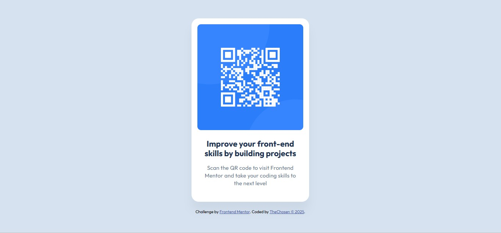

# Frontend Mentor - QR Code Component Solution

This is a solution to the [QR code component challenge on Frontend Mentor](https://www.frontendmentor.io/challenges/qr-code-component-iux_sIO_H). It is a simple front-end project that replicates a QR code card design from [Frontend Mentor](https://www.frontendmentor.io). The goal is to improve HTML and CSS skills by building a clean, responsive component based on a provided design. Frontend Mentor challenges help you improve your coding skills by building realistic projects.

## Table of contents

- [Overview](#overview)
  - [Screenshot](#screenshot)
  - [Live Demo and Links](#live-demo-and-links)
- [My process](#my-process)
  - [Built with](#built-with)
  - [Layout Features](#layout-features)
  - [Folder Structure](#-folder-structure)
- [Author](#author)
- [Credits](#credits)
- [License](#license)

## Overview

### 📸 Screenshot

### 🚀 Live Demo and Links

- Solution URL: [https://github.com/Ayanfe8/QR-Code-Component](https://github.com/Ayanfe8/QR-Code-Component)
- Live Demo URL: You can view the live version of the project [https://ayanfe8.github.io/QR-Code-Component/](https://ayanfe8.github.io/QR-Code-Component/)

## My process

### 🛠️ Built with

- HTML5
- CSS3
- Google Fonts (Outfit)

### 📐 Layout Features

- Centered card layout
- Responsive design for mobile and desktop
- Rounded corners and subtle shadow
- Clean typography and spacing
- Accessible alt text for the QR code image

### 📁 Folder Structure

qr-code-component/
├── index.html
├── css/
│ └── style.css
├── images/
│ ├── favicon.png
│ ├── image-qr-code.png
│ └── qr-code-solution-screenshot.jpg
└── README.md

## Author

- Website - [TheChosen](https://github.com/Ayanfe8)
- Frontend Mentor - [@Ayanfe8](https://www.frontendmentor.io/profile/Ayanfe8)

## ✨ Credits

Design provided by Frontend Mentor.
Built by Ayanfe — aspiring front-end developer.Acknowledgments

## 📄 License

This project is open-source and available under the MIT License.

---
